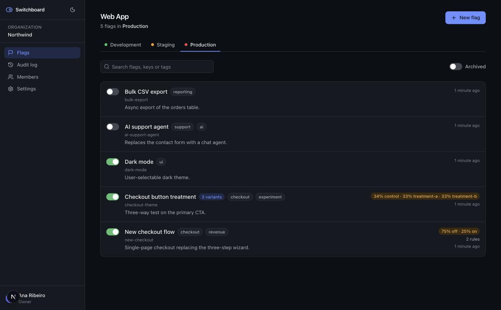
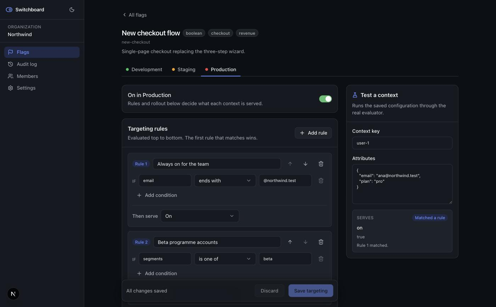
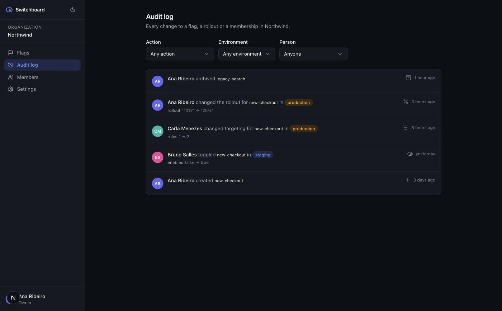

<p align="center">
  
</p>

<h1 align="center">Switchboard</h1>

<p align="center">
  Feature flags with targeting rules, staged rollouts and an audit trail.<br>
  <sub>Next.js 16 · React 19 · TypeScript · Postgres · Prisma 7</sub>
</p>

<br>

Ship code behind a switch. Turn it on for your own team first, then 5% of
traffic, then everyone, and keep a record of who changed what.

I wanted a portfolio project that behaves like software people actually use:
several tenants, roles that really do restrict things, and a screen whose state
is genuinely awkward to manage. The targeting engine is the part worth reading.



## Running it

Node 24, and there's an `.nvmrc` so `nvm use` handles it.

```bash
nvm use
npm install

npm run db:dev          # local Postgres, no Docker. Prints two URLs.
cp .env.example .env    # paste them in, plus an AUTH_SECRET
npm run db:migrate
npm run db:seed
npm run dev
```

Sign in with `ana@northwind.test` / `switchboard123`. The seed creates four
people on different roles; `diego@northwind.test` is a Viewer, so log in as him
to see the read-only side of the UI.

If you'd rather point it at a real database, put a Neon or Supabase URL in
`DATABASE_URL` and skip `db:dev`. Nothing else changes.

| Command | |
| --- | --- |
| `npm run dev` | dev server |
| `npm test` | the test suite |
| `npm run typecheck` | `tsc --noEmit` |
| `npm run db:studio` | Prisma Studio |
| `npm run db:reset` | drop, migrate, reseed |

## How targeting works

A flag holds one configuration per environment. When something asks for a value,
the evaluator walks it top to bottom:

1. Flag off? Serve the off variant, stop.
2. Walk the rules in order. First one whose conditions all match wins.
3. Nothing matched? Serve the default, or bucket the context through a
   percentage rollout.

Conditions inside a rule are ANDed. If you want OR, add another rule. Fifteen
operators cover strings, numbers, sets, presence and regex, and array attributes
match if any element matches, except on the negative operators where `not_in`
has to mean *none of these*.

Rollouts bucket on a Murmur3 hash of the context, so the same user always lands
in the same bucket. You can bucket on an attribute instead of the user, which is
how you keep a whole account on one side of a split rather than splitting the
account internally.



The panel on the right runs the real evaluator in the browser against the saved
config. Same function the server calls. It answers the question people actually
have before a rollout, which is "what would *this* user get, and why".

## Tests

```bash
npm test
```

88 tests, no database and no mocks, aimed at the modules where the logic lives.

The evaluator gets the most: operator semantics, fail-closed behaviour on bad
regex and non-numeric input, rollout stability, and a distribution test that
asserts a 10% rollout lands between 8.5% and 11.5% over 20k samples. That last
one is what catches a hash that clusters. Then the targeting reducer, the
membership rules, SDK key generation, and the config diffing — which has two
traps worth pinning down, since `jsonb` reorders keys on write and the editor
mints condition ids on load.

## Layout

```
src/
  lib/flags/       evaluation engine — pure, no dependencies
  lib/members/     who may change whom — pure
  server/
    auth/          password hashing, JWT session cookie
    tenancy/       org scoping and permissions
    flags/         mutations: scoped, permission-checked, audited
    members/       role changes and removals
    settings/      org, projects, SDK key generation
  components/ui/   primitives over Radix
  app/             routes
```



## What's missing

Being straight about it:

- There's no SDK. The evaluator was written to be extracted into one, but
  nothing delivers config to clients yet.
- SDK keys can be created and revoked, but nothing authenticates against them,
  because there's no public evaluation endpoint for them to open.
- Adding a member requires them to already have an account. No email
  invitations, and the dialog says so instead of pretending otherwise.
- Environments are created with a project and can't be added or renamed after.
- No scheduled or approval-gated changes.
